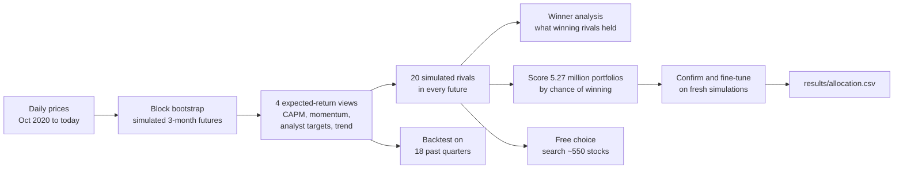

# Stock Competition Portfolio

How should \$100,000 be split across 10 stocks to have the best chance of **winning** a 3-month student stock-picking competition? And what kind of portfolio actually wins contests like this?

This project answers both with Monte Carlo simulation. It builds up to a million possible 3-month futures from real price history, simulates 20 rival students in each one, and records what the winners held. It then:

- scores all 5.3 million allowed ways to split the money by how often they finish first
- searches about 550 stocks for the best portfolio if any stocks had been allowed
- checks the method on 18 past quarters

> **Just want to read the analysis?** Open [`notebooks/1_build_portfolio.ipynb`](notebooks/1_build_portfolio.ipynb). GitHub shows it with all results and charts, with no installation needed.

## The competition

| | |
| --- | --- |
| Stocks | AAPL, NVDA, BSY, SNAP, JPM, NEE, DE, CAT, GOOGL, COST (all 10 must be held) |
| Weights | 5% to 20% per stock |
| Period | Buy at the close on Sep 14, 2026 and hold until the close on Dec 14, 2026 (64 trading days) |
| Winner | Highest return among about 20 students, each with their own stocks |

## Results at a glance

Prices through Sep 11, 2026.

| Stock | Weight | Amount |
| --- | --- | --- |
| NVDA, SNAP, GOOGL | 20% each | \$20,000 each |
| AAPL | 10% | \$10,000 |
| BSY, CAT, COST, DE, JPM, NEE | 5% each | \$5,000 each |

| | Recommended portfolio | Equal weight (10% each) |
| --- | --- | --- |
| Chance of finishing 1st of 21 | **10.1%** | 3.2% |
| Chance of finishing in the top 3 | 22.4% | 12.3% |
| Chance of losing money | 40.4% | 37.3% |
| Median 3-month return | +3.3% | +3.3% |
| Range (5th to 95th percentile) | −18.4% to +26.7% | −13.9% to +20.1% |

A random rival's chance of finishing first is 4.8%. Both portfolios have the same typical return, but the recommended one has a wider spread, so it reaches the winning zone far more often:


**Backtest:** at each of 18 past quarter starts, the same method was re-run using only data available on that date. Its pick beat random fields of 20 rivals **14.0%** of the time, against 5.2% for equal weight; the model had predicted 10.8%. Its average quarterly return was 5.4%, against 4.8% for equal weight, but the wins came from just 4 strong quarters. The strategy wins by occasionally finishing far ahead, not by reliably earning more.

### Who wins? What the winning rivals held

In every simulated future, the notebook records the winning rival's stocks. Every stock is equally likely to be picked by a rival, so a stock that shows up more often among *winners* is one that helps win. The ratio of the two is its **lift**.


- **Volatile stocks win.** The 15 highest-lift stocks (led by CVNA, SMCI and MRNA) average 72% annual volatility, against 27% for the 15 lowest-lift stocks. Across the pool, lift and volatility have a correlation of 0.80.
- **Winners bet more on those stocks.** When a winner holds a high-lift stock, it averages 10.6% of the portfolio, against 10.0% for rivals in general.

### Free choice: what if any stocks had been allowed?

The search considered about 550 stocks: the S&P 500, the Nasdaq-100, meme and crypto-linked stocks, and the rival pool. The best portfolio it found holds RIOT, PLTR and CVNA at 20% each, MSTR at 10%, and AMC, APPS, CLSK, GME, MARA and NET at 5% each; 8 of the 10 are meme or crypto-linked stocks.

| On the free-choice simulations | Free choice | Recommended portfolio |
| --- | --- | --- |
| Chance of finishing 1st | **33.4%** | 9.9% |
| Chance of losing money | 48.8% | 39.8% |
| Bad case (5th percentile) | −45.6% | −18.2% |


Stock choice matters far more than weights: re-weighting the 10 assigned stocks tripled the chance of winning, while free choice more than tripled it again, at the cost of a coin-flip chance of losing money. It's a thought experiment about what the model rewards, not a recommendation to buy those stocks.

## How it works



1. **Simulate futures.** Each 3-month future is stitched together from random one-month chunks of real history. All stocks are drawn on the same dates, so correlations and crashes carry over.
2. **Stay neutral on forecasts.** Past returns are poor forecasts, so the simulations are re-centered on four views of expected return, and the final choice averages across all four.
3. **Simulate the competition.** In every future, 20 rivals hold 10 random stocks from about 200 well-known companies under the same rules. What the winners held is recorded.
4. **Search exhaustively.** Every allowed portfolio on a 2.5% grid (5,266,030 of them) is scored on 50,000 futures, using all CPU cores. The best candidates are re-scored on 1,000,000 fresh futures and then fine-tuned at 1% steps.
5. **Search stock choice.** Starting from the assigned stocks and from the best single stocks, the free-choice search alternates between the best weights for a set of stocks and the best single swap of one stock for any candidate.
6. **Test honestly.** Sanity checks confirm the simulation's volatility, means and win counting; every result is confirmed on fresh simulations; and a walk-forward backtest measures how the method would have done in the past.

## Run it yourself

### 1. Install (once)

You need **Python 3.12 or newer** ([python.org](https://www.python.org/downloads/)). Download this project (green **Code** button → **Download ZIP**, then unzip) or clone it with Git. Then open a terminal in the project folder.

macOS or Linux:

```bash
python3 -m venv .venv
source .venv/bin/activate
pip install -r requirements.txt
```

Windows (PowerShell):

```powershell
py -m venv .venv
.venv\Scripts\Activate.ps1
pip install -r requirements.txt
```

### 2. Build the portfolio

With the virtual environment active (step 1), start Jupyter:

```bash
jupyter lab notebooks/1_build_portfolio.ipynb
```

Then choose **Run → Run All Cells**.

- **Full run:** about 12–15 minutes on a 10-core laptop, longer with fewer cores. It uses up to about 4 GB of memory. The first run also downloads about 570 stocks' prices, which takes a minute or two.
- **Quick test:** set `QUICK_MODE = True` in the settings cell. It takes about a minute.
- **Output:** `results/allocation.csv` and the charts in `docs/images/`. A same-day rerun reuses cached data from `data/`.

### 3. Track the portfolio during the competition

```bash
jupyter lab notebooks/2_track_portfolio.ipynb
```

Run all cells after the market closes (4 p.m. New York time), for example once a week. If the actual purchase prices differed from the Sep 14 closing prices, enter them in `FILL_PRICES` first.

### Troubleshooting

| Problem | Fix |
| --- | --- |
| `ModuleNotFoundError: No module named 'stock_competition'` | Jupyter is using a different Python. Activate `.venv` and start Jupyter from that same terminal, or run `python -m ipykernel install --user --name stock-competition` and pick that kernel under **Kernel → Change Kernel**. |
| A download error from Yahoo Finance | Usually temporary. Wait a minute and run the cells again; failed tickers are retried once automatically. |
| The run is too slow or runs out of memory | Set `QUICK_MODE = True`. |

## Project structure

```text
notebooks/
  1_build_portfolio.ipynb   Full analysis: data, simulation, who wins, search, free choice, backtest, allocation
  2_track_portfolio.ipynb   Weekly check-in during the competition
stock_competition/          Python package used by the notebooks
  data.py                   Prices, analyst targets and earnings dates (Yahoo Finance, cached daily)
  universe.py               Stock lists: rival pool, S&P 500 + Nasdaq-100 snapshot, speculative stocks
  stats.py                  Log returns, beta, volatility, drawdown, momentum, correlation
  scenarios.py              Block bootstrap and expected-return views
  rivals.py                 Simulated rival portfolios and what the winners held
  simulation.py             Simulated competitions and portfolio scoring (Scenarios)
  search.py                 Weight grids, multithreaded scoring, fine-tuning
  picks.py                  Free-choice stock search
  backtest.py               Walk-forward test on past quarters
  charts.py                 Chart style and one function per chart type
  market_calendar.py        NYSE trading days
  settings.py, cache.py, parallel.py, paths.py
tests/                      Unit tests (offline, synthetic data)
results/allocation.csv      The recommended allocation
docs/images/                Charts used in this README
```

## For developers

```bash
pip install -e ".[dev]"
pytest                          # 45 tests, a few seconds
pylint stock_competition tests
nbqa pylint notebooks
pyright stock_competition tests # type checks, same engine as VS Code's Pylance
```

GitHub Actions runs the same checks on every push, on Python 3.12 and 3.14.

## Limitations

- **A model, not a guarantee.** Three-month returns are mostly noise. Even the best portfolio loses the contest about 9 times out of 10.
- **The rivals are guesses.** Real classmates' stocks and weights are unknown; the simulated rivals pick at random from about 200 well-known companies.
- **Limited history.** About six years of shared history, including an AI-driven tech boom, a crypto boom and bust, and the 2022 bear market. The backtest covers only 18 quarters.
- **Stock lists are snapshots.** The index lists date from 2025; stocks listed after October 2020 are left out because the simulation needs their full history.
- **Free data.** Prices come from Yahoo Finance through the unofficial `yfinance` library, which can change or fail.

## Disclaimer

This is an educational project, not investment advice.

## License

[MIT](LICENSE)
