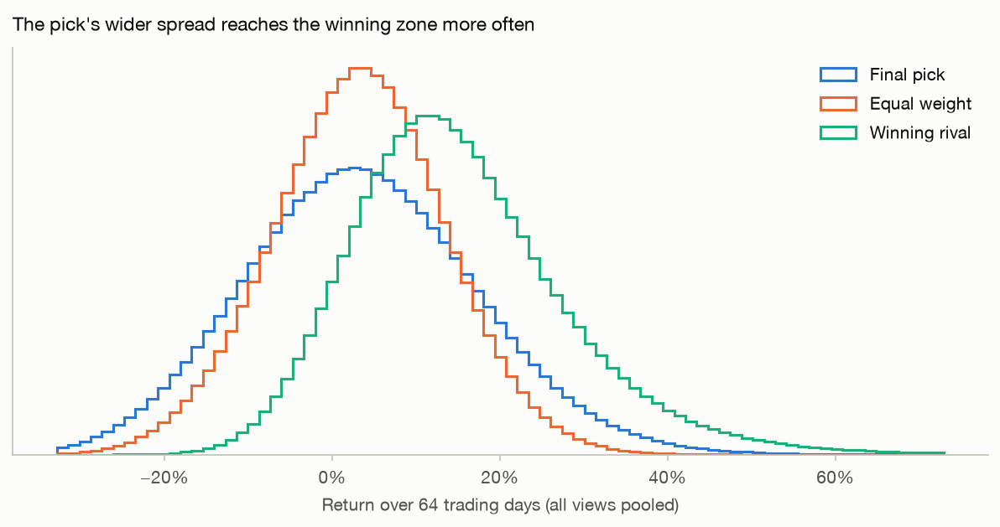
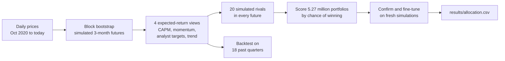

# Stock Competition Portfolio

How should \$100,000 be split across 10 stocks to have the best chance of **winning** a 3-month student stock-picking competition?

This project answers that with Monte Carlo simulation. It builds a million possible 3-month futures from real price history and simulates 20 rival students in each one. It then scores all 5.3 million allowed portfolios by how often they finish first, and checks the method on 18 past quarters.

> **Just want to read the analysis?** Open [`notebooks/1_build_portfolio.ipynb`](notebooks/1_build_portfolio.ipynb). GitHub shows it with all results and charts, with no installation needed.

## The competition

| | |
| --- | --- |
| Stocks | AAPL, NVDA, BSY, SNAP, JPM, NEE, DE, CAT, GOOGL, COST (all 10 must be held) |
| Weights | 5% to 20% per stock |
| Period | Buy at the close on Sep 14, 2026 and hold until the close on Dec 14, 2026 (64 trading days) |
| Winner | Highest return among about 20 students, each with their own stocks |

## Results at a glance

Prices through Sep 11, 2026.

| Stock | Weight | Amount |
| --- | --- | --- |
| NVDA, SNAP, GOOGL | 20% each | \$20,000 each |
| BSY | 10% | \$10,000 |
| AAPL, CAT, COST, DE, JPM, NEE | 5% each | \$5,000 each |

| | Recommended portfolio | Equal weight (10% each) |
| --- | --- | --- |
| Chance of finishing 1st of 21 | **11.3%** | 3.0% |
| Chance of finishing in the top 3 | 23.4% | 11.7% |
| Chance of losing money | 40.7% | 37.4% |
| Median 3-month return | +3.2% | +3.3% |
| Range (5th to 95th percentile) | −18.6% to +26.9% | −14.0% to +20.1% |

A random rival's chance of finishing first is 4.8%. Both portfolios have the same typical return, but the recommended one has a wider spread, so it reaches the winning zone far more often:



**Backtest:** at each of 18 past quarter starts, the same method was re-run using only data available on that date. Its pick beat random fields of 20 rivals **13.4%** of the time, against 4.1% for equal weight. The model had predicted 13.3%. Most of those wins came in a few strong quarters, and the average return was no higher than equal weight: the strategy wins by occasionally finishing far ahead, not by earning more.

## How it works



1. **Simulate futures.** Each 3-month future is stitched together from random one-month chunks of real history. All stocks are drawn on the same dates, so correlations and crashes carry over.
2. **Stay neutral on forecasts.** Past returns are poor forecasts, so the simulations are re-centered on four views of expected return, and the final choice averages across all four.
3. **Simulate the competition.** In every future, 20 rivals hold 10 random stocks from about 100 popular names under the same rules.
4. **Search exhaustively.** Every allowed portfolio on a 2.5% grid (5,266,030 of them) is scored on 50,000 futures, using all CPU cores. The best candidates are re-scored on 1,000,000 fresh futures and then fine-tuned at 1% steps.
5. **Test honestly.** Sanity checks confirm the simulation's volatility, means and win counting, and a walk-forward backtest measures how the method would have done in the past.

## Run it yourself

### 1. Install (once)

You need **Python 3.12 or newer** ([python.org](https://www.python.org/downloads/)). Download this project (green **Code** button → **Download ZIP**, then unzip) or clone it with Git. Then open a terminal in the project folder.

macOS or Linux:

```bash
python3 -m venv .venv
source .venv/bin/activate
pip install -r requirements.txt
```

Windows (PowerShell):

```powershell
py -m venv .venv
.venv\Scripts\Activate.ps1
pip install -r requirements.txt
```

### 2. Build the portfolio

With the virtual environment active (step 1), start Jupyter:

```bash
jupyter lab notebooks/1_build_portfolio.ipynb
```

Then choose **Run → Run All Cells**.

- **Full run:** about 12 minutes on a 10-core laptop, longer with fewer cores. It uses 3–4 GB of memory.
- **Quick test:** set `QUICK_MODE = True` in the settings cell. It takes about a minute.
- **Output:** `results/allocation.csv` and the charts in `docs/images/`. A same-day rerun reuses cached data from `data/`.

### 3. Track the portfolio during the competition

```bash
jupyter lab notebooks/2_track_portfolio.ipynb
```

Run all cells after the market closes (4 p.m. New York time), for example once a week. If the actual purchase prices differed from the Sep 14 closing prices, enter them in `FILL_PRICES` first.

### Troubleshooting

| Problem | Fix |
| --- | --- |
| `ModuleNotFoundError: No module named 'stock_competition'` | Jupyter is using a different Python. Activate `.venv` and start Jupyter from that same terminal, or run `python -m ipykernel install --user --name stock-competition` and pick that kernel under **Kernel → Change Kernel**. |
| A download error from Yahoo Finance | Usually temporary. Wait a minute and run the cells again. |
| The run is too slow or runs out of memory | Set `QUICK_MODE = True`. |

## Project structure

```text
notebooks/
  1_build_portfolio.ipynb   Full analysis: data, simulation, search, backtest, final allocation
  2_track_portfolio.ipynb   Weekly check-in during the competition
stock_competition/          Python package used by the notebooks
  data.py                   Prices, analyst targets and earnings dates (Yahoo Finance, cached daily)
  stats.py                  Beta, volatility, drawdown, momentum, correlation
  scenarios.py              Block bootstrap and expected-return views
  rivals.py                 Simulated rival portfolios
  search.py                 Portfolio grid, multithreaded scoring, fine-tuning
  backtest.py               Walk-forward test on past quarters
  market_calendar.py        NYSE trading days
  universe.py               Stocks the rivals choose from
  settings.py, cache.py, parallel.py, charts.py, paths.py
tests/                      Unit tests (offline, synthetic data)
results/allocation.csv      The recommended allocation
docs/images/                Charts used in this README
```

## For developers

```bash
pip install -e ".[dev]"
pytest                          # 31 tests, a few seconds
pylint stock_competition tests
nbqa pylint notebooks
```

GitHub Actions runs the same checks on every push, on Python 3.12 and 3.14.

## Limitations

- **A model, not a guarantee.** Three-month returns are mostly noise. Even the best portfolio loses the contest about 9 times out of 10.
- **The rivals are guesses.** Real classmates' stocks and weights are unknown.
- **Limited history.** About six years of shared history, including an AI-driven tech boom and the 2022 bear market. The backtest covers only 18 quarters.
- **Free data.** Prices come from Yahoo Finance through the unofficial `yfinance` library, which can change or fail.

## Disclaimer

This is an educational project, not investment advice.

## License

[MIT](LICENSE)
