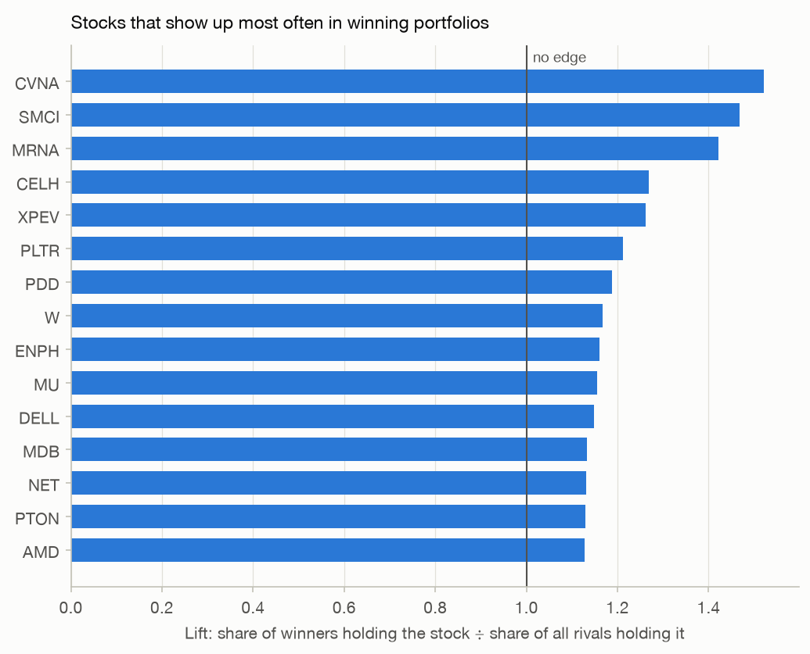
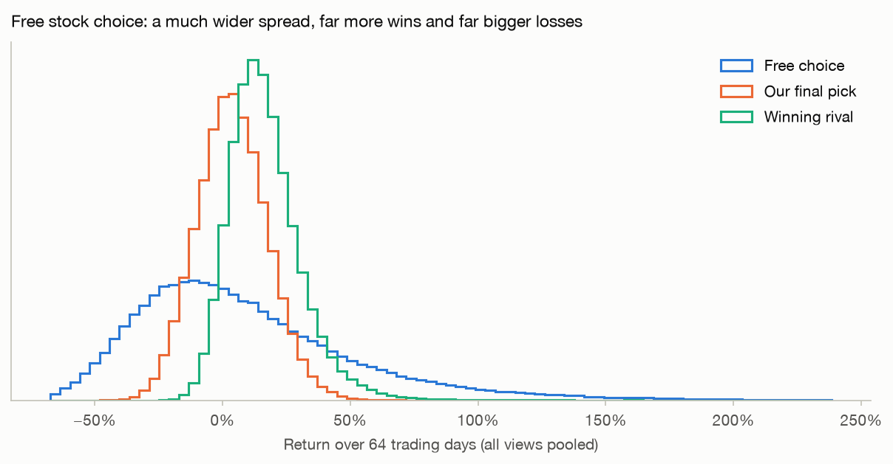
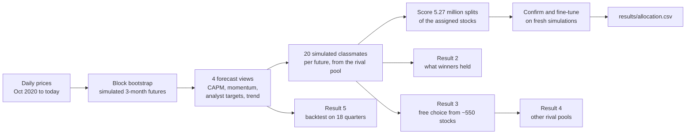

# Stock Competition Portfolio

**The situation.** A university investment class runs a stock-picking contest. Each of about 20 students picks 10 stocks, splits a hypothetical \$100,000 among them (between 5% and 20% per stock), and holds them for three months. The highest return wins.

**This project** takes one student's 10 picks and uses simulation to answer three questions:

1. **How should the money be split** across those 10 stocks to have the best chance of finishing first?
2. **What do winning portfolios look like?**
3. **How much better could it be** if any 10 stocks had been allowed?

> **Just want to read the analysis?** Open [`notebooks/1_build_portfolio.ipynb`](notebooks/1_build_portfolio.ipynb). GitHub shows it with all results and charts, with no installation needed.

## Key ideas (read this first)

### Winning a contest is not the same as investing well

A steady, diversified portfolio is sensible for real savings, but it almost never finishes first among 20 rivals: someone with a riskier mix usually gets lucky. So this project doesn't maximize return or return per unit of risk. It maximizes the **chance of beating every rival**.

### How the classmates are simulated

The other students' picks are unknown, so the model invents them. In each of up to a million simulated 3-month futures, it creates **20 rivals**. Each rival holds:

- **10 random stocks from the *rival pool***: about 200 well-known companies such as Apple, Tesla, Netflix, JPMorgan and Nike, the kind of stocks students tend to pick
- **random weights** that follow the same 5–20% rules

Every simulated future gets a fresh set of rivals, so the results average over many possible classmates.

### P(win): the number everything is judged by

**P(win)** is the share of simulated futures in which a portfolio beats all 20 rivals. A rival with no edge wins about 1 time in 21, so **4.8% is the baseline**.

### Two stock lists with two different jobs

| List | Size | Who picks from it | Why this list |
| --- | --- | --- | --- |
| **Rival pool** | ~200 stocks | The simulated classmates | A guess about real students: famous, popular companies |
| **Candidate list** | ~550 stocks | Only us, in the "free choice" what-if (result 3) | Everything plausible: the S&P 500, the Nasdaq-100, meme and crypto stocks, and the rival pool |

The rival pool is an **assumption about people**; the candidate list is a **search space** for our own portfolio. They are deliberately different. Result 4 shows what happens if the classmates picked from the longer list too.

## Results

Prices through Sep 11, 2026. The purchase is at the close on Sep 14, 2026, and the contest ends at the close on Dec 14, 2026 (64 trading days).

### 1. The best split of the 10 assigned stocks

The assigned stocks are AAPL, NVDA, BSY, SNAP, JPM, NEE, DE, CAT, GOOGL and COST. All 10 must be held.

| Stock | Weight | Amount |
| --- | --- | --- |
| NVDA, SNAP, GOOGL | 20% each | \$20,000 each |
| AAPL | 10% | \$10,000 |
| BSY, CAT, COST, DE, JPM, NEE | 5% each | \$5,000 each |

| | Recommended split | Equal weight (10% each) |
| --- | --- | --- |
| Chance of finishing 1st of 21 | **10.1%** | 3.2% |
| Chance of finishing in the top 3 | 22.4% | 12.3% |
| Chance of losing money | 40.4% | 37.3% |
| Median 3-month return | +3.3% | +3.3% |
| Range (5th to 95th percentile) | −18.4% to +26.7% | −13.9% to +20.1% |

Both portfolios have the same typical return. The recommended one puts the most money in the most volatile stocks, which widens the range of outcomes, so it reaches the returns that win the contest far more often:


### 2. What winning portfolios look like

In every simulated future, the model records what the winning classmate held. Every stock in the rival pool is equally likely to be picked, so a stock that shows up more often among *winners* is one that helps win. How much more often is its **lift**: 1.5 means winners held it 50% more often than rivals in general.



- **Volatile stocks win.** The 15 highest-lift stocks (led by CVNA, SMCI and MRNA) average 72% annual volatility, against 27% for the 15 lowest-lift stocks. Across the pool, lift and volatility have a correlation of 0.80.
- **Winners bet more on those stocks.** When a winner holds a high-lift stock, it averages 10.6% of the portfolio, against 10.0% for rivals in general.

### 3. Free choice: what if any 10 stocks had been allowed?

The assignment fixed the 10 stocks. As a what-if, the model searched the **~550-stock candidate list** for the 10 stocks and weights with the highest P(win). The competition stays the same: the simulated classmates still pick from the ~200-stock rival pool.

The best portfolio it found holds CVNA, PLTR and RIOT at 20% each, MSTR at 10%, and AMC, APPS, CLSK, GME, MARA and NET at 5% each. Eight of the 10 are meme or crypto-linked stocks. Two searches from different starting points (the assigned stocks, and the best single stocks) reached exactly this portfolio.

| On the free-choice simulations | Free choice | Recommended split |
| --- | --- | --- |
| Chance of finishing 1st | **33.4%** | 9.9% |
| Chance of losing money | 48.8% | 39.8% |
| Bad case (5th percentile) | −45.6% | −18.2% |



Stock choice matters far more than weights: re-weighting the assigned stocks tripled the chance of winning, while free choice more than tripled it again, at the cost of a coin-flip chance of losing money. This shows what the model rewards; it is not a recommendation to buy those stocks.

### 4. How much the guess about classmates matters

Every chance above depends on the rival pool. This experiment keeps the simulated markets identical and changes only what the classmates pick from:

| Classmates pick from | Stocks | Winning rival: median return | Winning rival: 90th percentile | P(win) recommended split | P(win) equal weight | P(win) free choice |
| --- | --- | --- | --- | --- | --- | --- |
| Popular companies (the model) | 205 | 14.9% | 34.3% | **10.0%** | 3.2% | 33.5% |
| + S&P 500 and Nasdaq-100 | 529 | 13.0% | 27.8% | **17.1%** | 6.9% | 36.8% |
| + meme and crypto (all candidates) | 555 | 14.7% | 38.3% | **13.1%** | 4.9% | 32.5% |

- **Adding hundreds of steady companies makes winning easier.** Classmates holding utilities and insurers rarely get lucky, so a lower return wins.
- **Adding meme and crypto stocks makes it harder again.** They push the luckiest classmates' returns back up (see the 90th percentile).
- **The recommendation doesn't change.** The best weights for the assigned stocks were identical against all three pools; only the chances moved.

So treat the chances as estimates under an assumption about the classmates. If their real picks were known, entering them as the rival pool would improve the model more than any other change. (This table uses the free-choice simulations with three forecast views, so its first row differs slightly from result 1.)

### 5. Would the method have worked before?

At each of 18 past quarter starts, the whole method was re-run using only the data available on that date, then scored on what actually happened. Its pick beat random fields of 20 classmates **14.0%** of the time, against 5.2% for equal weight; the model had predicted 10.8%. Its average quarterly return was 5.4%, against 4.8% for equal weight, but the wins came from just 4 strong quarters: the strategy wins by occasionally finishing far ahead, not by reliably earning more.

## How it works



1. **Simulate futures.** Each 3-month future is stitched together from random one-month chunks of real price history. All stocks are drawn on the same dates, so their correlations and crashes carry over.
2. **Stay neutral on forecasts.** Past returns are poor forecasts, so the simulations are re-centered on four forecast views: CAPM, momentum, analyst targets and the historical trend. Results average across all four.
3. **Simulate the classmates.** In every future, 20 rivals hold 10 random stocks from the rival pool with random weights under the same rules.
4. **Search every split.** All 5,266,030 ways to split the money in 2.5% steps are scored on 50,000 futures, using every CPU core. The best candidates are re-checked on 1,000,000 fresh futures and fine-tuned in 1% steps.
5. **Search stock choice.** For result 3, the search alternates between finding the best weights for a set of 10 stocks and the best single swap of one stock for any candidate.
6. **Test honestly.** Sanity checks confirm the simulated volatility, averages and win counting; results are confirmed on fresh simulations; and the backtest measures past performance.

## Run it yourself

### 1. Install (once)

You need **Python 3.12 or newer** ([python.org](https://www.python.org/downloads/)). Download this project (green **Code** button → **Download ZIP**, then unzip) or clone it with Git. Then open a terminal in the project folder.

macOS or Linux:

```bash
python3 -m venv .venv
source .venv/bin/activate
pip install -r requirements.txt
```

Windows (PowerShell):

```powershell
py -m venv .venv
.venv\Scripts\Activate.ps1
pip install -r requirements.txt
```

### 2. Build the portfolio

With the virtual environment active (step 1), start Jupyter:

```bash
jupyter lab notebooks/1_build_portfolio.ipynb
```

Then choose **Run → Run All Cells**.

- **Full run:** about 12–15 minutes on a 10-core laptop, longer with fewer cores. It uses up to about 4 GB of memory. The first run also downloads prices for about 570 stocks, which takes a minute or two.
- **Quick test:** set `QUICK_MODE = True` in the settings cell. It takes about a minute.
- **Output:** `results/allocation.csv` and the charts in `docs/images/`. A same-day rerun reuses cached data from `data/`.
- **Your own assumptions:** the settings cell controls the rules, the number of rivals, the rival pool (`RIVAL_UNIVERSE`) and the candidate list (`CANDIDATE_UNIVERSE`). The stock lists live in `stock_competition/universe.py`.

### 3. Track the portfolio during the competition

```bash
jupyter lab notebooks/2_track_portfolio.ipynb
```

Run all cells after the market closes (4 p.m. New York time), for example once a week. If the actual purchase prices differed from the Sep 14 closing prices, enter them in `FILL_PRICES` first.

### Troubleshooting

| Problem | Fix |
| --- | --- |
| `ModuleNotFoundError: No module named 'stock_competition'` | Jupyter is using a different Python. Activate `.venv` and start Jupyter from that same terminal, or run `python -m ipykernel install --user --name stock-competition` and pick that kernel under **Kernel → Change Kernel**. |
| A download error from Yahoo Finance | Usually temporary. Wait a minute and run the cells again; failed tickers are retried once automatically. |
| The run is too slow or runs out of memory | Set `QUICK_MODE = True`. |

## Glossary

| Term | Meaning |
| --- | --- |
| **Rival** | One simulated classmate: 10 random stocks from the rival pool with random weights |
| **Rival pool** | The ~200 well-known companies the simulated classmates pick from |
| **Candidate list** | The ~550 stocks the free-choice search may pick from |
| **P(win)** | The share of simulated futures in which a portfolio beats all 20 rivals |
| **Free choice** | The what-if search for the best 10 stocks when the assignment's picks are ignored |
| **Lift** | How much more often winning rivals hold a stock than rivals in general |
| **Forecast view** | One assumption about each stock's expected return (CAPM, momentum, analyst targets or historical trend) |
| **Volatility** | How much a price swings: the standard deviation of returns, scaled to a year |
| **Bootstrap** | Building new samples by re-drawing pieces of real data at random |
| **Backtest** | Testing a method on past data, using only what was known at each date |

## Project structure

```text
notebooks/
  1_build_portfolio.ipynb   Full analysis with explanations and all five results
  2_track_portfolio.ipynb   Weekly check-in during the competition
stock_competition/          Python package used by the notebooks
  data.py                   Prices, analyst targets and earnings dates (Yahoo Finance, cached daily)
  universe.py               Stock lists: rival pool, S&P 500 + Nasdaq-100 snapshot, speculative stocks
  stats.py                  Log returns, beta, volatility, drawdown, momentum, correlation
  scenarios.py              Block bootstrap and forecast views
  rivals.py                 Simulated rivals and what the winners held
  simulation.py             Simulated competitions and portfolio scoring
  search.py                 Weight grids, multithreaded scoring, fine-tuning
  picks.py                  Free-choice stock search
  backtest.py               Walk-forward test on past quarters
  charts.py                 Chart style and one function per chart type
  market_calendar.py        NYSE trading days
  settings.py, cache.py, parallel.py, paths.py
tests/                      Unit tests (offline, synthetic data)
results/allocation.csv      The recommended split
docs/images/                Charts used in this README
```

## For developers

```bash
pip install -e ".[dev]"
pytest                          # 45 tests, a few seconds
pylint stock_competition tests
nbqa pylint notebooks
pyright stock_competition tests # type checks, same engine as VS Code's Pylance
```

GitHub Actions runs the same checks on every push, on Python 3.12 and 3.14.

## Limitations

- **A model, not a guarantee.** Three-month returns are mostly noise. Even the best split loses the contest about 9 times out of 10.
- **The classmates are a guess.** Result 4 shows how much the chances depend on it.
- **Limited history.** About six years of shared price history, including an AI-driven tech boom, a crypto boom and bust, and the 2022 bear market. The backtest covers only 18 quarters.
- **Stock lists are snapshots.** The index lists date from 2025, and stocks listed after October 2020 are left out because the simulation needs their full history.
- **Free data.** Prices come from Yahoo Finance through the unofficial `yfinance` library, which can change or fail.

## Disclaimer

This is an educational project, not investment advice.

## License

[MIT](LICENSE)
